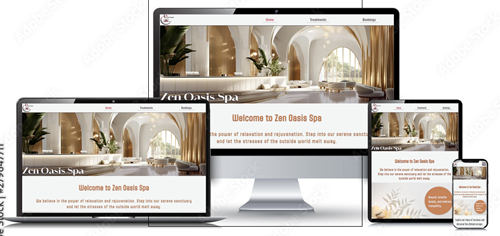

  

  

# Zen Oasis Spa

[Zen Oasis Spa](https://samatkinsonmodeste.github.io/ci-p-one-zen-oasis-spa/index.html) website was created as a digital gateway to the serene experience that awaits within its walls. It serves as an invitation for visitors to explore the array of rejuvenating treatments and facilities Zen Oasis offer. The website reflects its commitment to relaxation, wellness, and rejuvenation. It’s designed to provide a glimpse into the tranquil atmosphere and holistic approach that define it's spa, encouraging guests to book their next escape to rejuvenation. 🌸💆‍♀️

## User Story:

- #### Persona: Jenny, a 28-year-old marketing executive.
- #### Goal: To find a spa that offers a tranquil environment and specialized facial treatments that cater to her stressed skin

### Acceptance Criteria:

- The spa website must provide clear information on various facial treatments, including mud and mask therapies.

- The booking process should be straightforward, allowing Jenny to schedule an appointment with ease.

- High-quality images of the spa’s serene setting and treatment rooms should be displayed to set the mood for relaxation.

## Table of Contents

## UX

- [Goals](#goals)
- [Visitors Goals](#visitors-goals)
- [Visual Design](#visual-design)
- [Features](#features)
  - [Home Page](#home-page)
  - [Treatment Page](#treatment-page)
  - [Booking Page ](#booking-page)
- [Author](#author)
- [Author](#author)
- [Acknowledgments](#acknowledgments) Coming Soon
