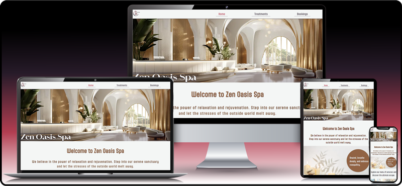
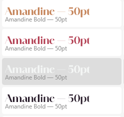
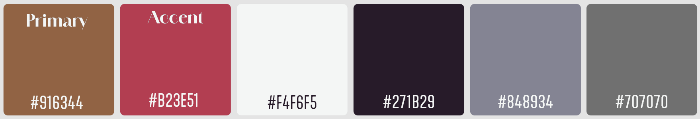

  

  

# Zen Oasis Spa

[Zen Oasis Spa](https://samatkinsonmodeste.github.io/ci-p-one-zen-oasis-spa/index.html) website was created as a digital gateway to the serene experience that awaits within its walls. It serves as an invitation for visitors to explore the array of rejuvenating treatments and facilities Zen Oasis offer. The website reflects its commitment to relaxation, wellness, and rejuvenation. It’s designed to provide a glimpse into the tranquil atmosphere and holistic approach that define it's spa, encouraging guests to book their next escape to rejuvenation. 🌸💆‍♀️

## User Story:

- #### Persona: Jenny, a 28-year-old marketing executive.
- #### Goal: To find a spa that offers a tranquil environment and specialized facial treatments that cater to her stressed skin

### Acceptance Criteria:

- The spa website must provide clear information on various facial treatments, including mud and mask therapies.

- The booking process should be straightforward, allowing Jenny to schedule an appointment with ease.

- High-quality images of the spa’s serene setting and treatment rooms should be displayed to set the mood for relaxation.

## Table of Contents

## UX

- [Goals](#goals)
  - [Visitors Goals](#visitors-goals)
- [Visual Design](#visual-design)
  - [High Fidelity Mockup](#high-fidelity-mockup)
  - [Fonts](#fonts)
  - [Colour](#colour-palette)
  - [Styling](#styling)
- [Features](#features)
  - [Navigation Bars](#naviagation-bars)
    - [Mobile Navigation](mobile-navigation)
    - [Tablet & Desktop Navigation](tablet-desktop-navigation)
  - [Home Page](#home-page)
  - [Treatment Page](#treatment-page)
  - [Booking Page ](#booking-page)
  - [Social Media](social-media)
- [Author](#author)

## Goals

### Visitors Goals

User goals are:

- Get a sense of the spa's ambience
- View all treatment massages available
- Book a time and date for their treatment

### Visual Design

#### High Fidelity Mockup

With a clear idea of the site's look, I went straight to a high-fidelity mockup using Adobe XD.

> The standard process is to create a Wireframe first.

  

### Fonts

  

- Adobe's [Amandine](https://fonts.adobe.com/fonts/amandine) font has clean lines and graceful curves that evoke a sense of elegance and tranquillity.
  It complements the serene atmosphere of Zen Oasis, conveying relaxation and sophistication.
  Amandine’s legibility ensures that headings are easy to read, even at larger sizes. The balanced letterforms enhance clarity, making it ideal for titles and headers. Amandine works well across various devices and screen resolutions. Whether on a desktop or mobile, it maintains its visual appeal.

  

- Adobe's [Aptly](https://fonts.adobe.com/fonts/aptly) font was used for body text. It is also a sans-serif font, and the combination of **Amandine** (for headings) and **Aptly** (for body text) creates a pleasing contrast. **Amandine’s** sophistication draws attention, while **Aptly** maintains legibility, striking a harmonious balance.
  **Aptly’s** contemporary aesthetics align with the site's modern and serene vibe. Its simplicity conveys professionalism and a sense of calm. Aptly adapts well to various screen sizes, ensuring a consistent experience on desktops, tablets, and mobiles.

### Colour Palette

  

- The primary colour evokes relaxation, tranquillity, and sandy beaches, setting the overall tone and mood of the website.
- The accent colour adds visual interest and draws attention to specific elements.
- My white shade represents purity, cleanliness, and spaciousness. As the background colour for content areas, it ensures readability and a sense of openness.
- My black, which hints at the accent colour, makes a great contrast.
- My greys provide subtle contrast and depth.

### Styling

Over the years, my CSS journey has been fun. 
I love how you can use CSS not only for the layout of your pages   but also to add artistic touches to your site using properties such as:
 

- [Text-Shadow](https://www.w3schools.com/cssref/css3_pr_text-shadow.php)
- [Border-Radius](https://www.w3schools.com/cssref/css3_pr_border-radius.php) which can be used to make interestng shapes of a block element.
- [RGBA Function](https://css-tricks.com/the-power-of-rgba/) used with background images can change the look and feel of your image by taking advantage of the Aplha value.
- I used [Normalize.css](https://necolas.github.io/normalize.css/) to reset all elements across all browsers.
- [Media Queries](https://www.w3schools.com/cssref/css3_pr_mediaquery.php) - I used several to ensure my layout stayed intact for most devices.

## Features

### Navigation Bars
