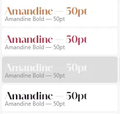
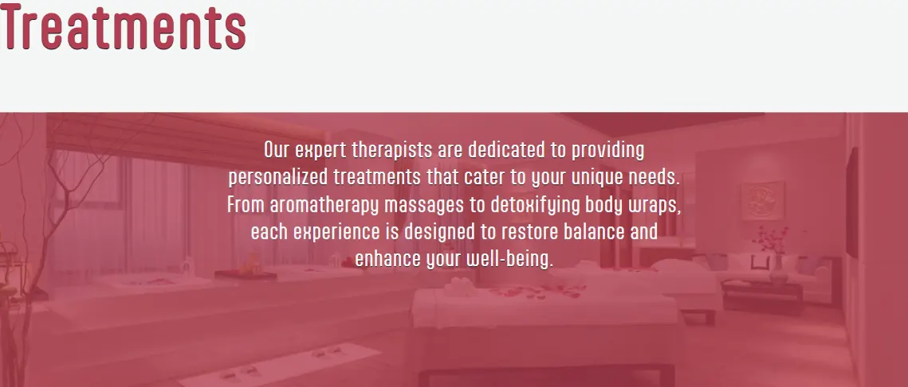

  

  

# Zen Oasis Spa

[Zen Oasis Spa](https://samatkinsonmodeste.github.io/ci-p-one-zen-oasis-spa/index.html) website was created as a digital gateway to the serene experience that awaits within its walls. It serves as an invitation for visitors to explore the array of rejuvenating treatments and facilities Zen Oasis offer. The website reflects its commitment to relaxation, wellness, and rejuvenation. It’s designed to provide a glimpse into the tranquil atmosphere and holistic approach that define it's spa, encouraging guests to book their next escape to rejuvenation. 🌸💆‍♀️

## User Story:

- #### Persona: Jenny, a 28-year-old marketing executive.
- #### Goal: To find a spa that offers a tranquil environment and specialized facial treatments that cater to her stressed skin

### Acceptance Criteria:

- The spa website must provide clear information on various facial treatments, including mud and mask therapies.

- The booking process should be straightforward, allowing Jenny to schedule an appointment with ease.

- High-quality images of the spa’s serene setting and treatment rooms should be displayed to set the mood for relaxation.

## Table of Contents

## UX

- [Goals](#goals)
  - [Visitors Goals](#visitors-goals)
- [Visual Design](#visual-design)
  - [High Fidelity Mockup](#high-fidelity-mockup)
  - [Fonts](#fonts)
  - [Colour](#colour-palette)
  - [Styling](#styling)
- [Features](#features)
  - [Navigation Bars](#naviagation-bars)
    - [Mobile Navigation](#mobile-navigation)
    - [Tablet Desktop Navigation](#tablet-desktop-navigation)
  - [Home Page](#home-page)
    - [Home Welcome Section](#home-welcome-section)
    - [Unwind Tranquillity](#unwind-tranquillity)
    - [Explore Escape](#explore-escape)
    - [Treatments Experts](#treatments-experts)
  - [Treatment Page](#treatment-page)
    - [Treatment Introduction](#treatment-introduction)
    - [Body Massages](#body-massages)
    - [Facial Massages](#body-massages)
  - [Booking Page](#booking-page)
    - [Booked Page](#booked-page)
    - [Booked Page Links](#booked-page-links)
    - [Booked Page More](#booked-page-more)
  - [Footer](#footer)
- [Author](#author)

## Goals

### Visitors Goals

User goals are:

- Get a sense of the spa's ambience
- View all treatment massages available
- Book a time and date for their treatment

### Visual Design

#### High Fidelity Mockup

With a clear idea of the site's look, I went straight to a high-fidelity mockup using Adobe XD.

> The standard process is to create a Wireframe first.

  

### Fonts

  

- Adobe's [Amandine](https://fonts.adobe.com/fonts/amandine) font has clean lines and graceful curves that evoke a sense of elegance and tranquillity.
  It complements the serene atmosphere of Zen Oasis, conveying relaxation and sophistication.
  Amandine’s legibility ensures that headings are easy to read, even at larger sizes. The balanced letterforms enhance clarity, making it ideal for titles and headers. Amandine works well across various devices and screen resolutions. Whether on a desktop or mobile, it maintains its visual appeal.

  

- Adobe's [Aptly](https://fonts.adobe.com/fonts/aptly) font was used for body text. It is also a sans-serif font, and the combination of **Amandine** (for headings) and **Aptly** (for body text) creates a pleasing contrast. **Amandine’s** sophistication draws attention, while **Aptly** maintains legibility, striking a harmonious balance.
  **Aptly’s** contemporary aesthetics align with the site's modern and serene vibe. Its simplicity conveys professionalism and a sense of calm. Aptly adapts well to various screen sizes, ensuring a consistent experience on desktops, tablets, and mobiles.

### Colour Palette

  

- The primary colour evokes relaxation, tranquillity, and sandy beaches, setting the overall tone and mood of the website.
- The accent colour adds visual interest and draws attention to specific elements.
- My white shade represents purity, cleanliness, and spaciousness. As the background colour for content areas, it ensures readability and a sense of openness.
- My black, which hints at the accent colour, makes a great contrast.
- My greys provide subtle contrast and depth.

### Styling

Over the years, my CSS journey has been fun. 
I love how you can use CSS not only for the layout of your pages   but also to add artistic touches to your site using properties such as:
 

- [Text-Shadow](https://www.w3schools.com/cssref/css3_pr_text-shadow.php) By giving the horizontal value zero, the vertival setting a positive value and a small blur value text can seem as if they are popping or leaping off the page.
- [Border-Radius](https://www.w3schools.com/cssref/css3_pr_border-radius.php) which can be used to make interestng shapes of a block element.
- [RGBA Function](https://css-tricks.com/the-power-of-rgba/) used with background images can change the look and feel of your image by taking advantage of the Aplha value.
- I used [Normalize.css](https://necolas.github.io/normalize.css/) to reset all elements across all browsers.
- [Media Queries](https://www.w3schools.com/cssref/css3_pr_mediaquery.php) - I used several to ensure my layout stayed intact for most devices.

## Features

### Navigation Bars

#### Mobile Navigation

  
  

- The logo returns a user to the home page.
- I created the hamburger with span tags.
- With the use of a checkbox along with it's corresponding label animation of the span elements can be toggled to display the nav menu.
- The accent color was used for the text links to indicate what page the user is currently on.

#### Tablet Desktop Navigation

  

- The full nav functions the same as the mobile.
- The logo takes you back to the home page.
- The accent colour is used on the links to indicate the current page a user is on.

## Home Page

### Home Welcome Section

  

- A luxurious reception picture establishes the ambience for a high-class spa escape.
- A heartfelt welcome message embodies the spa's principles and atmosphere.

### Unwind Tranquillity

  

- An image of all the tools used for massages and candles representing the relaxing, quiet, calm, and romantic ambiance of a spa.
- Embracing simplicity, the text emphasizes the essential activities of mind and body.

### Explore Escape

  

- Text encouraging users to explore the spa's services.
- The image of the pool, towel, and orchard flowers will evoke thoughts of escape, vacation, and relaxation.

### Treatments Experts

  

- An enchanting scene is set with a background image of massage beds and rose petals, creating the perfect ambiance for the magic of massages to unfold.
- The accompanying text outlines the high standard of massages provided by the expert therapist.

## Treatment Page

### Treatment Introduction

  

- The image of the waiting area in the massage therapy rooms and the inviting beds ignites a sense of anticipation for what lies ahead in the massage room.
- The text beautifully highlights the three main aspects of well-being that a massage therapist can nurture: the mind, body, and spirit.

### Body Massages

  

- Each Massage article has an image of the specific massage.
  Which gives a visual demostration of that specific massage.
- Every body article massage is color-coded, representing the uniqueness of each massage.
- A comprehensive description of the massage and its benefits for the body, mind, and spirit will help users determine if it's the perfect fit for them.

### Facial Massages

  

- Facial massages are categorized separately from body massages.
- Images are a powerful tool to distinguish between the various types of facial massages and to illustrate their unique characteristics.
- Each paragraph unlocks the potential of each facial massage as it reveals different purposes, guiding the user to choose the one that's right for them.

## Booking Page

  

- A form provides the method for a user to book their massage.
- In the first part of the form, a user can enter their contact details.
- The second part of the form presents an opportunity for users to select the massage that best suits their needs and preferences.
- The user has the power to select the perfect date for their rejuvenating massage.

### Booked Page Links

  

- Once a user submits the booking form through the action attribute of the form, they are taken to the _Thank you for booking_ page.
- With a Book link, a user is empowered to return to the booking page and indulge in booking another rejuvenating massage experience.
- The alternative is for the user to utilize the "Home page" link.

### Booked Page More

  

- An invitation to fully embrace the additional amenities at the spa is warmly extended.
